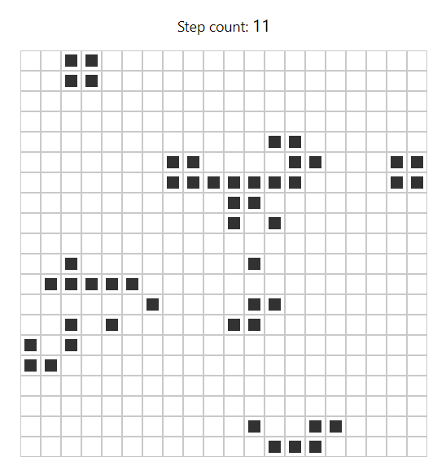

## Coding challange nr 1

# Conway's Game of Life

Conway's Game of Life is a cellular automaton with extremely simple rules:

-   if a cell is not alive and exactly three its neighours are alive the cell becomes alive too (i.e. is born, presumably by reproduction)
-   otherwise the cell remains dead
-   if a cell is alive and it has two or three alive neighbours it remains alive (as if the conditions are stable)
-   however, if there are less than two or more than three alive neighbours the cell dies (due to under- or overpopulation)

Here is my recreation of this simple automaton rendered in browser using canvas API.

