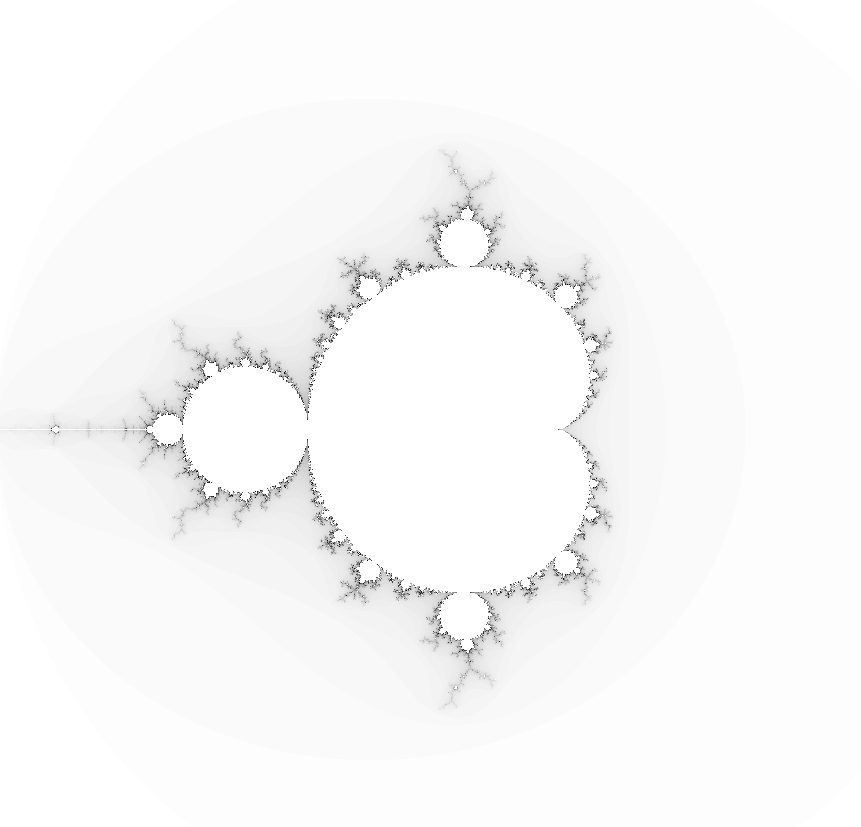

## Coding challange nr 2

# Visualizing Mandelbrot Set

Mandalbrot Set is a famous set of complex numbers, famous for its visualizations.

Via wikipedia: "The Mandelbrot set is the set of values of c in the complex plane for which the orbit of the critical point z = 0 under iteration of the quadratic map

remains bounded."

Here is my recreation of Mandelbrot set ranging from -2.0 to +2.0 using canvas API.

